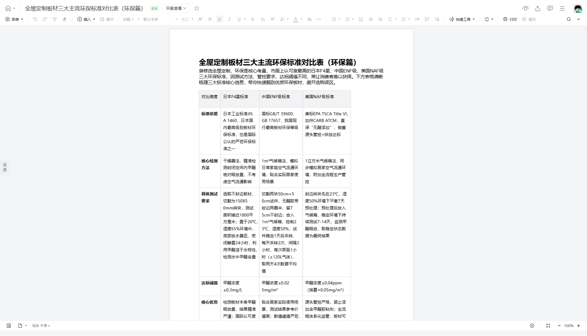

# 全屋定制板材三大主流环保标准对比表（环保篇）

> 来源：腾讯文档 - 装修知识库
>
> 原始链接：https://doc.weixin.qq.com/doc/w3_ATMA_wb6AOACN2BsDAZnjQj2YzZs2?scode=AEAAkAegAFMdxdQ4DZ

---

## 正文内容

菜单
插入
图片
标题 1
默认字体
小二
快捷工具
打印
提及
菜单
插入
图片
标题 1
默认字体
小二
快捷工具
打印
提及
用户可以通过 control 加 ~ 打开或关闭无障碍功能
目录
926 个字
100%
text

---

## 完整页面截图

---

*提取时间: 2026-06-09 22:25:37*
