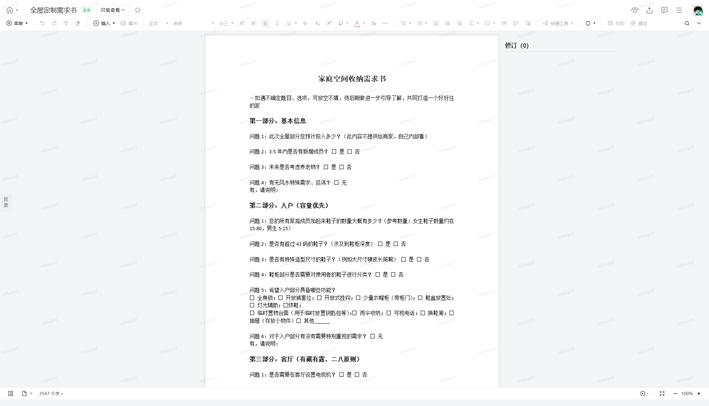

# 全屋定制需求书

> 来源：腾讯文档 - 装修知识库
>
> 原始链接：https://doc.weixin.qq.com/doc/w3_AW8AXwbwAN0CNfzDGTumLQWuKV2k6?scode=AEAAkAegAFMBQauH7mAW8AXwbwAN0

---

## 正文内容

菜单
插入
图片
正文
宋体
小三
快捷工具
打印
提及
菜单
插入
图片
正文
宋体
小三
快捷工具
打印
提及
修订（0）
用户可以通过 control 加 ~ 打开或关闭无障碍功能
目录
3547 个字
100%
text

---

## 完整页面截图

---

*提取时间: 2026-06-09 22:06:47*
