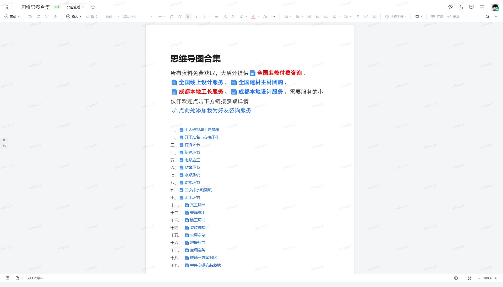

# 思维导图合集

> 来源：腾讯文档 - 装修知识库
>
> 原始链接：https://doc.weixin.qq.com/doc/w3_AW8AXwbwAN0CNGwAKyEs5Q7a75H2t?scode=AEAAkAegAFMoCqOZ5vAW8AXwbwAN0

---

## 正文内容

菜单
插入
图片
标题
默认字体
小一
快捷工具
打印
提及
菜单
插入
图片
标题
默认字体
小一
快捷工具
打印
提及
全国装修付费咨询
全国线上设计服务
全国建材主材团购
成都本地工长服务
成都本地设计服务
点此处添加我为好友咨询服务
工人选择与工费参考
开工准备与交底工作
打拆环节
新建环节
电路施工
封窗环节
水路系统
防水环节
二次排水和回填
木工环节
瓦工环节
美缝施工
油工环节
瓷砖选择
全屋定制
地暖环节
空调选购
暖通三方案对比
中央空调安装落地
用户可以通过 control 加 ~ 打开或关闭无障碍功能
目录
241 个字
100%
text

---

## 完整页面截图

---

*提取时间: 2026-06-09 22:06:30*
